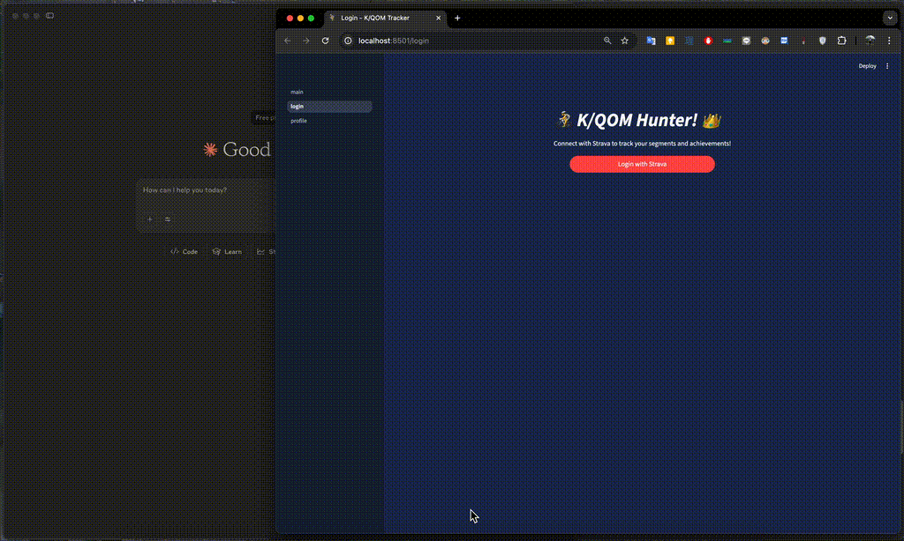

# K/QOM Hunter

## Project Overview

**K/QOM Hunter** is a full-stack web application that tracks performance across starred Strava segments, enabling cyclists to monitor progress toward achieving King/Queen of the Mountain (K/QOM) status on their favorite routes. The application features an integrated AI analysis system powered by Claude AI through a custom Model Context Protocol (MCP) server, providing personalized performance insights and data-driven training recommendations.

---

## Project Structure and Technical Information

- [Backend README](backend/README.md)
- [Frontend README](frontend/README.md)

---

---
